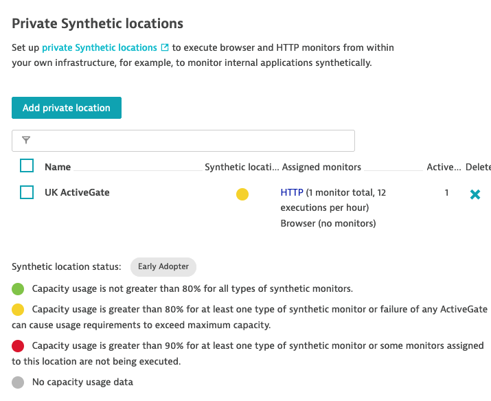
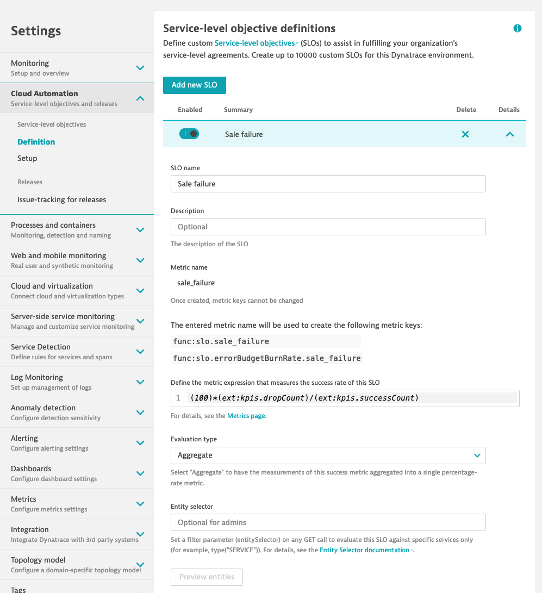
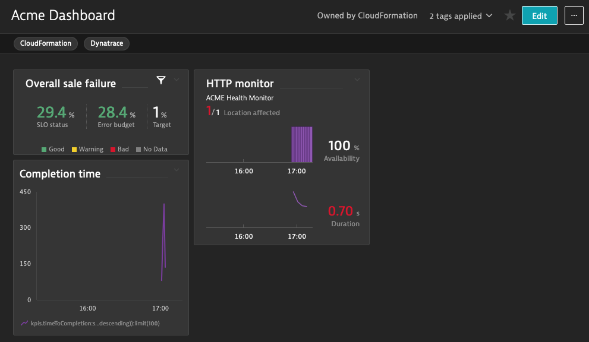

# Setting up a new project with service level objective, locations, monitors and metrics


With the Dynatrace resources for CloudFormation, you can kick off the monitoring of new projects simply, efficiently, and consistently.

Project build pipelines and other project-bootstrap infrastructure can also be included
as part of the CloudFormation, so organizations can have a quick and common way to bootstrap a new project.

This demo will use the following types:

* `Dynatrace::Environment::Metric` - to monitor a part of an application in Dynatrace.
* `Dynatrace::Environment::SyntheticMonitor` - to gather and control metrics.
* `Dynatrace::Environmnet::SyntheticLocation` - to execute monitors, and more.
* `Dynatrace::Environment::ServiceLevelObjective` - to define operation goals based on metrics and monitors.
* `Dynatrace::Configuration::Dashboard` - to define a Dynatrace dashboard that will display KPIs and other vital information for the app operation.

### Nodes

Typically, Dynatrace will trigger and execute monitors though a series of nodes. Dynatrace provide some all around the world, but you can also provide your own through ActiveGate.
Find or create a monitor-enabled note the Dynatrace UI, and make a note of its numeric ID. This will be the parameter `NodeIds`:
```
Parameters:
  NodeIds:
    Type: List<Number>
    Description: Enter the IDs of existing nodes, capable of running monitors
```

### Create Metrics

We can define the set of metrics we want to monitor. Imagine an "Acme" e-commerce web application for which we want to monitor specific KPIs
like `Time to completion` and `Sale failure rate`.
We can define metric in Dynatrace to track these as follows:

```yaml
  TimeToCompletionMetric:
    Type: Dynatrace::Environment::Metric
    Properties:
      Id: custom:kpis.timeToCompletion
      DisplayName: Average time for a customer to complete the sales process, from cart
      Unit: Second (s)
      Dimensions:
        - ACME
        - KPIS
      Types:
        - Web
  SuccessCountMetric:
    Type: Dynatrace::Environment::Metric
    Properties:
      Id: custom:kpis.successCount
      DisplayName: Number of people having something in their cart and completing the sale
      Unit: Count (count)
      Dimensions:
        - ACME
        - KPIS
      Types:
        - Web
  DropCountMetric:
    Type: Dynatrace::Environment::Metric
    Properties:
      Id: custom:kpis.dropCount
      DisplayName: Number of people having something in their cart, to failing to complete the sale
      Unit: Count (count)
      Dimensions:
        - ACME
        - KPIS
      Types:
        - Web
```

### Create a location and monitors

Monitoring KPIs is crucial for all business. But the health of your application is also vital. Here we create a location
and monitors to track this with `ActivegateLocation` and `HealthMonitor`.

```yaml
  ActiveGateLocation:
    Type: Dynatrace::Environment::SyntheticLocation
    Properties:
      Type: PRIVATE
      Name: UK ActiveGate
      CountryCode: GB
      City: Edinburgh
      Latitude: 55.9533
      Longitude: 3.1883
      LocationNodeOutageDelayInMinutes: 3
      Nodes: !Ref NodeIds
  HealthMonitor:
    Type: Dynatrace::Environment::SyntheticMonitor
    Properties:
      FrequencyMin: 5
      Name: ACME Health Monitor
      Enabled: true
      Type: HTTP
      AnomalyDetection:
        OutageHandling:
          GlobalOutage: true
          GlobalOutagePolicy:
            ConsecutiveRuns: 3
          LocalOutage: true
          LocalOutagePolicy:
            AffectedLocations: 1
            ConsecutiveRuns: 3
        LoadingTimeThresholds:
          Enabled: true
          Thresholds:
            - Type: TOTAL
              ValueMs: 100
      Script:
        version: 1.0
        requests:
          - url: https://aws.amazon.com
            method: GET
            description: HTTP request test
            validation:
              rules:
                - type: httpStatusesList
                  value: 500, 400
                  passIfFound: false
                - type: httpStatusesList
                  value: 200, 204, 302
                  passIfFound: true
      Locations:
        - !Ref ActiveGateLocation
```

### Create a service level objective

We can tie our custom metrics together to compose and aggregate them in a service level objective to calculate the
sale failure rate.

```yaml
  SaleFailureServiceLevelObjective:
    Type: Dynatrace::Environment::ServiceLevelObjective
    DependsOn:
      - SuccessCountMetric
      - DropCountMetric
    Properties:
      Name: Sale failure
      MetricExpression: "(100)*(ext:kpis.dropCount)/(ext:kpis.successCount)"
      EvaluationType: AGGREGATE
      Target: 1
      Warning: 3
      ErrorBudgetBurnRate:
        FastBurnThreshold: 10
        BurnRateVisualizationEnabled: true
      Timeframe: "-1w"
```

### Dashboard to easy consumption

Finally, we can also create a dashboard to will surface – in one place –all these vital information that we have setup above 

```yaml
  AcmeDashboard:
    Type: Dynatrace::Configuration::Dashboard
    Properties:
      DashboardMetadata:
        Name: Acme Dashboard
        Owner: CloudFormation
        Shared: false
        Tags:
          - CloudFormation
          - Dynatrace
      Tiles:
        - name: Sales failure
          tileType: SLO
          configured: true
          bounds:
            top: 0
            left: 0
            width: 304
            height: 152
          tileFilter:
            timeframe: -1w
          assignedEntities:
            - !Ref SaleFailureServiceLevelObjective
          metric: METRICS=true;LEGEND=true;PROBLEMS=true;decimals=10;customTitle=Overall sale failure;
        - name: Uptime
          tileType: SYNTHETIC_HTTP_MONITOR
          configured: true
          bounds:
            top: 0
            left: 304
            width: 304
            height: 304
          assignedEntities:
            - !Ref HealthMonitor
        - name: Completion time
          tileType: DATA_EXPLORER
          configured: true
          bounds:
            top: 152
            left: 0
            width: 304
            height: 304
          customName: Data explorer results
          queries:
            - id: A
              metric: ext:kpis.timeToCompletion
              timeAggregation: DEFAULT
              sortBy: DESC
              limit: 100
              enabled: true
          visualConfig:
            type: GRAPH_CHART
            global:
              hideLegend: false
            rules:
              - matcher: "A:"
                properties:
                  color: DEFAULT
            axes:
              xAxis:
                displayName: ""
                visible: true
              yAxes:
                - displayName: ""
                  visible: true
                  min: AUTO
                  max: AUTO
                  position: LEFT
                  queryIds:
                    - A
                  defaultAxis: true
            heatmapSettings:
              yAxis: VALUE
            thresholds:
              - axisTarget: LEFT
                rules:
                  - color: "#7dc540"
                  - color: "#f5d30f"
                  - color: "#dc172a"
                queryId: ""
                visible: true
            tableSettings:
              isThresholdBackgroundAppliedToCell: false
            graphChartSettings:
              connectNulls: false
            honeycombSettings:
              showHive: true
              showLegend: true
              showLabels: false
```
### Conclusion

As a result, we have 3 custom metrics created:


Our location and monitor is also added to our environment:


The Service Level Objective is also set to calculate the Sale failure rate:


And a dashboard is available to display this data to the user:

